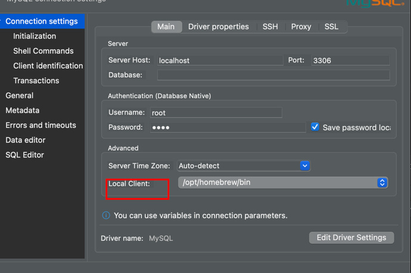

# 기타

[Native client is not specified for connection DBeaver](https://david.raleche.com/web-consulting/how-to-fix-dbeaver-native-client-is-not-specified-for-connection/)




# RDB

## MYSQL && MariaDB

[[Mysql] 버전 확인하는 방법](https://deeplify.dev/database/troubleshoot/how-to-check-mysql-version)
<br/>

[mysql dump 옵션](https://xinet.kr/?p=2675)


### mysql 서버 시작 - mac / linux

1. MAC
   mysql 서버 시작
```aidl
   mysql.server start
   mysql 서버 재시작
   mysql.server restart
```
2. Linux
```aidl
   mysql 서버 시작
   service mysql start
   systemctl start mysql.service
   mysql 서버 재시작
   service mysql restart
   systemctl restart mysql.service
   profile
```


[[MySQL] foreign key(외래키) 추가, 삭제, 확인 방법](https://allg.tistory.com/37)
<br/>

[[2019] 200만 동접 게임을 위한 MySQL 샤딩](https://www.youtube.com/watch?v=8Eb_n7JA1yA&list=PLiLLi47PCMPjvVIba_5Tzl--QqblJkpnZ&index=37&ab_channel=NHNCloud)
<br/>

[[MYSQL] 📚 JOIN과 서브쿼리 차이 및 변환 💯 정리](https://inpa.tistory.com/entry/MYSQL-%F0%9F%93%9A-JOIN%EA%B3%BC-%EC%84%9C%EB%B8%8C%EC%BF%BC%EB%A6%AC-%EC%B0%A8%EC%9D%B4-%EB%B0%8F-%EB%B3%80%ED%99%98-%F0%9F%92%AF-%EC%A0%95%EB%A6%AC)
<br/>


[MariaDB 계정 생성 및 권한](https://izigom.tistory.com/entry/MariaDB-%EA%B3%84%EC%A0%95-%EC%83%9D%EC%84%B1-%EB%B0%8F-%EA%B6%8C%ED%95%9C%EC%B6%9C%EC%B2%98-MariaDB-%EA%B3%84%EC%A0%95-%EC%83%9D%EC%84%B1-%EB%B0%8F-%EA%B6%8C%ED%95%9C%EC%9E%91%EC%84%B1%EC%9E%90-%EC%9A%B0%EC%95%BC)
<br/>

[]()
<br/>

[]()
<br/>

[]()
<br/>

[]()
<br/>

[]()
<br/>


## ANSI SQL


[Subquery in SQL | Correlated Subquery + Complete SQL Subqueries Tutorial](https://www.youtube.com/watch?v=nJIEIzF7tDw&list=PLiLLi47PCMPjvVIba_5Tzl--QqblJkpnZ&index=46&ab_channel=techTFQ)
<br/>

[비전공자를 위한 SQL](https://brunch.co.kr/brunchbook/beginnersql)
<br/>

[DB 파티셔닝(Partitioning)이란](https://gmlwjd9405.github.io/2018/09/24/db-partitioning.html)
<br/>

[PIVOT, UNPIVOT (행렬 변환)](https://ggmouse.tistory.com/128)
<br/>

[Mysql 사용자 추가, 제거 및 권한 부여](https://cjh5414.github.io/mysql-create-user/)
<br/>

[]()
<br/>


## Oracle


[오라클 SQL과 PL/SQL을 다루는 기술](https://thebook.io/006696/)
<br/>

[꿈꾸는 개발자, DBA 커뮤니티 구루비](http://www.gurubee.net/)
<br/>

[]()
<br/>


# NOSQL

[NoSQL 데이터베이스란? Cloud Firestore는 어떻게 구조화되나요? | Cloud Firestore 알아보기 1편](https://www.youtube.com/watch?v=v_hR4K4auoQ&list=PLiLLi47PCMPjvVIba_5Tzl--QqblJkpnZ&index=189&ab_channel=Firebase)


[]()
<br/>

[]()
<br/>

[]()
<br/>

[]()
<br/>

[]()
<br/>

